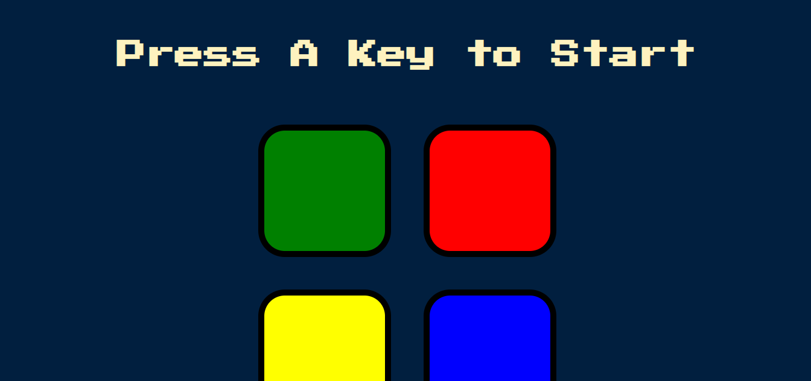
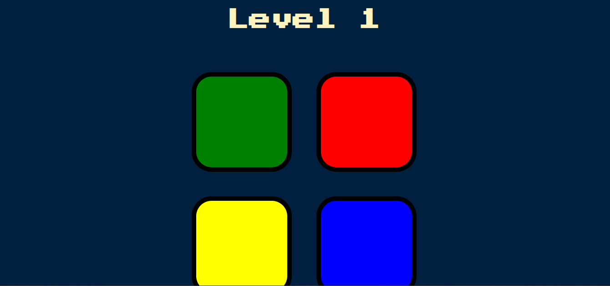

# Simon Game 🎮

This is a simple browser-based **Simon Game** built using HTML, CSS, JavaScript, and jQuery. The game challenges the player to follow and repeat an ever-growing sequence of colors. It’s a fun way to practice JavaScript logic, animations, and user interaction.

## 🧠 How to Play

1. Press any key to start the game.
2. Watch the color sequence that lights up.
3. Repeat the sequence by clicking the colored buttons in the same order.
4. Each level adds one more color to the sequence.
5. The game ends if you click the wrong color.

## 🔧 Technologies Used

- HTML5
- CSS3
- JavaScript (ES6)
- jQuery

## 📁 Project Structure

```
├── index.html       # Main HTML page
├── styles.css       # Styling for the game
├── game.js          # Game logic using jQuery
├── sounds/          # Sound files for each button (not included here)
└── screenshots/     # Screenshots of gameplay
```

## 💡 Features

- Level tracking and display
- Visual and sound feedback
- Game over detection and restart

## 📸 Preview

### Start Screen


### Level 1 Example


## 📜 License
This project is open source and free to use for learning purposes.
